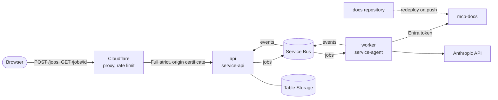

# Agent runtime

What runs when a visitor of [mastrocola.dev](https://mastrocola.dev) asks how the site works. The decisions and their trade-offs are in [ADR-007](../adr/007-agent-runtime.md); the agent itself is described in [agent-v1](agent-v1.md). This page is the current picture and is updated as the system changes.

## Components

| Component | Repository | Responsibility |
|---|---|---|
| Question thread | [www](https://github.com/mastrocola-dev/www) | Sends the question with a Turnstile token, polls the job, renders the answer as text and builds the source links |
| Edge | [infra](https://github.com/mastrocola-dev/infra) `agent/edge.tf` | `api.mastrocola.dev` behind the Cloudflare proxy; one rate limiting rule; Full (strict) with an origin certificate kept in Key Vault |
| `api` | [service-api](https://github.com/mastrocola-dev/service-api) | Decides whether a question may run, owns every piece of state, answers the polling |
| `worker` | [service-agent](https://github.com/mastrocola-dev/service-agent) | Runs the `ask` instance for one job and reports progress; stores nothing |
| `mcp-docs` | [mcp-docs](https://github.com/mastrocola-dev/mcp-docs), deployed from this repository | Serves these documents to the agent, read-only |

The three services are function apps on Flex Consumption, each with its own storage account and its own user-assigned identity ([ADR-006](../adr/006-identity-and-secrets.md)). Nothing runs while nobody asks.

## One question

1. The question field gains focus: the page loads Turnstile and calls `POST /warm`, which wakes the idle queue path while the visitor types.
2. `POST /jobs` reaches `api` through Cloudflare. `api` checks, in order, the question size, the daily budget, the Turnstile token, concurrency and the per-address quota; it stores the job as `queued` and sends a message to `jobs`.
3. `worker` picks the message up, publishes `started`, runs the agent against `mcp-docs` and the Anthropic API, and publishes a `step` after each model or tool call.
4. `worker` checks the answer (size, at least one source, every source an existing document) and publishes `completed` or `failed` with the cost.
5. `api` applies each event to the job; the page polls `GET /jobs/{id}` every 1.5 seconds and shows the state, then the answer.

Events can arrive out of order, so each carries a sequence number and a finished job never changes. A message delivered twice is failed instead of run again.

## Limits

| Limit | Value | Enforced by |
|---|---|---|
| Requests per address | 20 per 10 seconds | Cloudflare |
| Question size | 3–500 characters | `api` |
| Questions per address | 10 per day | `api` |
| Concurrent questions | 3 | `api` |
| Daily spending | US$ 1 | `api`, from the cost each job reports |
| One run | 6 model calls, 30 000 tokens, 60 seconds | `worker` |
| Answer | 1500 characters, 5 sources | `worker`, checked again by `api` |
| Instances per service | 2 | platform |
| Monthly spending on the model | workspace limit at the provider | Anthropic |

## Trust boundaries

- **Internet to `api`.** The origin accepts Cloudflare addresses only, which is what makes the client address in `CF-Connecting-IP` trustworthy. Other Cloudflare tenants can still reach the origin; Turnstile, quota and budget are enforced at the origin for that reason.
- **Visitor text to the model.** The question is data: delimited, never followed as instructions, answered by an instance with read-only tools and the smallest budgets. The answer is untrusted too: checked by `worker`, stored by `api`, inserted as text by the page.
- **`worker` to `mcp-docs`.** An Entra token whose only accepted caller is the worker identity. `mcp-docs` has no network restriction.
- **Services to data.** Queues, tables, storage and the vault are reached by identity; no connection string or key exists. `api` reads only the Turnstile secret, `worker` only the Anthropic key.
- **Pipelines to Azure.** Each repository deploys its own service through OIDC, with rights on that one app.

## Not built yet

- Alerts on daily cost, dead-lettered messages and failure rate; today these are visible only by looking
- An OpenTelemetry exporter in `worker`; runs are logged as metadata lines
- Mutual TLS between Cloudflare and the origin
- Conversation memory: every question is independent
- Streaming or push: progress is polled

## Operating it

| Task | Where |
|---|---|
| Infrastructure, identities, edge, certificate rotation | [infra README](https://github.com/mastrocola-dev/infra#agent-specifics) |
| Secret inventory and rotation | [secret-rotation](../runbooks/secret-rotation.md) |
| Contract and state of the API | [service-api README](https://github.com/mastrocola-dev/service-api#contract) |
| Worker messages, guardrails and traces | [service-agent README](https://github.com/mastrocola-dev/service-agent#runtime-worker) |
| What the page shows and why | [www README](https://github.com/mastrocola-dev/www#question-box) |
