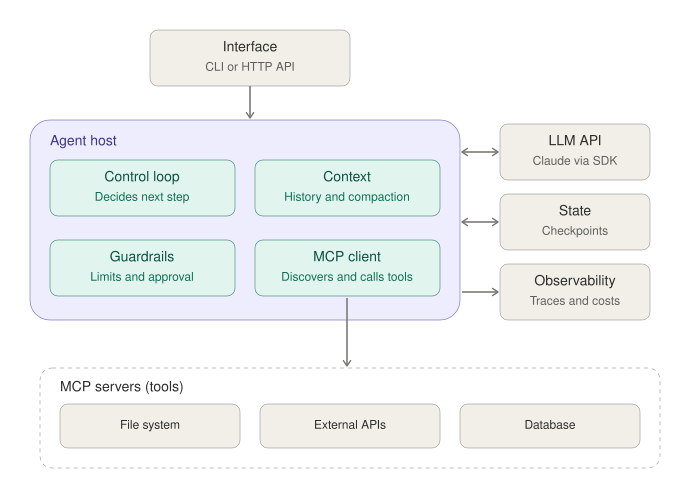

# Agent base architecture

Single-agent baseline. Tools are exposed exclusively through MCP servers, keeping the agent host decoupled from tool implementations.

## Flow

1. The interface sends a task to the control loop.
2. The loop builds the prompt from the context and calls the LLM.
3. Tool calls requested by the model pass through the guardrails, then the MCP client routes them to the matching server.
4. Tool results return to the context; the loop repeats until the model finishes or a limit is reached.
5. State stores checkpoints for resumable tasks; observability records every step (tokens, cost, latency).

## Components

| Component | Responsibility |
|---|---|
| Control loop | Runs the reason-act-observe cycle; enforces stop conditions |
| Context | Holds conversation and step history; compacts when needed |
| Guardrails | Step limit, timeouts, human approval for side-effecting actions |
| MCP client | Tool discovery and invocation via MCP |
| LLM API | Reasoning and tool selection |
| State | Checkpoints for resume after failure or approval pause |
| Observability | Structured traces per model and tool call |